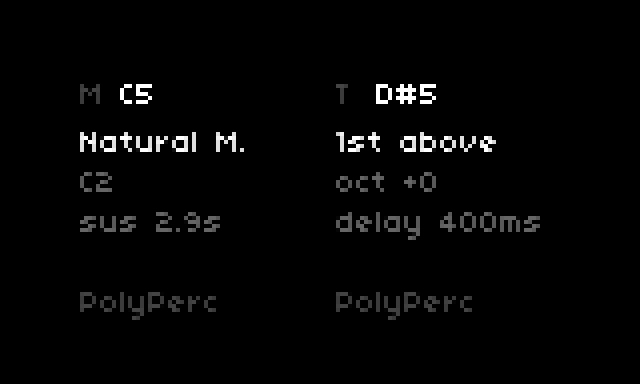
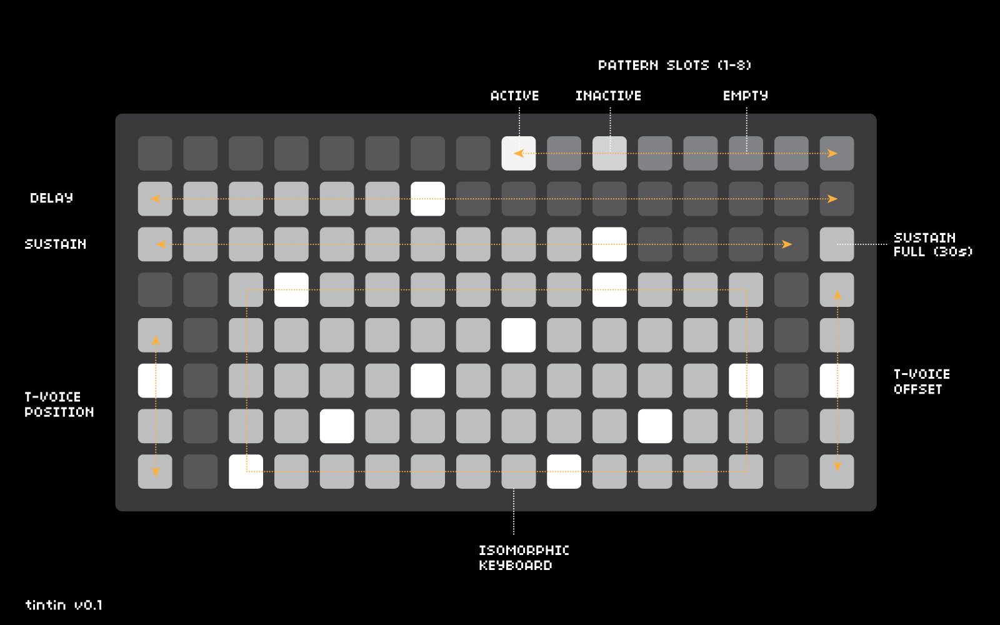

# tintin

A [Norns](https://monome.org/docs/norns/) script implementing [Arvo Pärt's tintinnabuli technique](https://en.wikipedia.org/wiki/Tintinnabuli) — a compositional method built around two voices:

- **M-voice** (melody) — played by you, moving stepwise through a scale
- **T-voice** (bell) — generated automatically, arpeggating a fixed tonic triad above or below each melody note

Notes can be played via a monome grid, a MIDI controller, or looped using the built-in pattern recorder.



Long time listener, first time caller. I've had a Norns Shield and/or Monome Norns for 5 or 6 years now, and have delighted in the weird inventive brilliance of this community. Finally I decided - with the very considerable help of Claude Code, and looking at many other superb scripts - to try to build one myself.

Keen for any feedback/thoughts/requests - will hopefully get a chance to create a video once we get to v1.0, in the meantime, a few audio examples:

---

## LLM disclosure

I have virtually no experience writing code - Claude Code was absolutely instrumental in building this, alongside trying to understand basic concepts through looking at existing scripts (eg. sonocircuit's wonderful [sidvagn](https://github.com/sonocircuit/sidvagn)).

---

## Requirements

- [Norns](https://monome.org/docs/norns/) (any version)
- [monome grid](https://monome.org/docs/grid/) (optional but recommended)
- MIDI controller (optional)
- [nb](https://github.com/sixolet/nb) voices (optional, for extended sound sources)

---

## Installation

From Maiden:

```
;install https://github.com/waternogetenemy/tintin
```

Or via SSH into Norns:

```
git clone https://github.com/waternogetenemy/tintin.git ~/dust/code/tintin
```

---

## Grid layout



### Row 1 — Pattern slots (cols 9–16)
Eight pattern recorder slots. Short press to record/stop/resume. Hold to clear.

| State | Brightness |
|-------|-----------|
| Empty | Dim |
| Recording | Full |
| Playing | Medium |
| Stopped | Low |

### Row 2 — T-voice delay (cols 1–16)
Sets the delay between the M-voice and T-voice triggering. Left = 0ms, right = 1000ms.

### Row 3 — Sustain (cols 1–15, col 16)
Controls note length/release. Col 16 activates **hold mode** (30s sustain). Press any col 1–15 to exit hold mode and set a new sustain value.

### Rows 4–8 — Isomorphic keyboard (cols 3–14)
A scalar isomorphic keyboard. Root notes are highlighted bright. Moving right advances one scale degree; moving up advances by the row interval (4 or 5 degrees, set in params).

### Col 1, rows 5–8 — T-voice position
Sets the relationship of the T-voice to the M-voice:

| Row | Position |
|-----|----------|
| 5 | 2nd above |
| 6 | 1st above |
| 7 | 1st below |
| 8 | 2nd below |

### Col 16, rows 4–8 — T-voice octave offset
Shifts the T-voice up or down by octave:

| Row | Offset |
|-----|--------|
| 4 | +2 oct |
| 5 | +1 oct |
| 6 | 0 |
| 7 | −1 oct |
| 8 | −2 oct |

---

## Norns controls

### Encoders
| Encoder | Function |
|---------|----------|
| E1 | Volume |
| E2 | Edit selected M-column parameter |
| E3 | Edit selected T-column parameter |

### Keys
| Key | Function |
|-----|----------|
| K2 | Navigate screen rows up |
| K3 | Navigate screen rows down |
| K1 + K2/K3 | Panic (all notes off) |

### Screen

The display is split into M (left) and T (right) columns. K2/K3 navigate between rows; E2 edits the highlighted M parameter and E3 edits the T parameter.

| Row | M column | T column |
|-----|----------|----------|
| 1 | Scale | T-voice position |
| 2 | Root note | T-voice octave |
| 3 | Sustain | T-voice delay |

The bottom of the screen shows the active sound source for each voice.

---

## Sound sources

Each voice (M and T) can use a different sound source, set independently in params:

- **PolyPerc** — Norns' built-in polyphonic engine
- **MIDI out** — sends note on/off to an external synth or DAW, with separate MIDI channels per voice
- **nb** — any installed [nb](https://github.com/sixolet/nb) voice

---

## Pattern recorder

Eight pattern slots (grid row 1, cols 9–16):

- **Press an empty slot** — starts recording immediately (including silence)
- **Press again** — stops recording and starts looping
- **Press a playing pattern** — stops it
- **Press a stopped pattern** — resumes it
- **Hold any slot** — clears it

Patterns are saved with psets and restored on load.

---

## MIDI input

Connect a MIDI controller and set the MIDI In Device in params. Incoming notes are quantized to the current scale and the T-voice is generated automatically — the same as playing on the grid.

**Note:** if your MIDI controller is also receiving MIDI out from Norns, make sure the in and out devices are set to different ports to avoid feedback loops.

---

## Params

| Param | Description |
|-------|-------------|
| Scale | Scale selection (full musicutil set) |
| Row Interval | Degrees per row on the grid keyboard (4 or 5) |
| Bottom-Left Note | Root note / octave of the grid keyboard |
| T-Voice Position | Triad relationship of T to M voice |
| T-Voice Delay | Delay in ms before T-voice triggers |
| T-Voice Octave | Octave shift for T-voice |
| Sustain | Note length / PolyPerc release |
| M-Voice / T-Voice | Sound source per voice |
| MIDI Out Device | MIDI output port |
| MIDI Out Ch (M/T) | MIDI channel per voice |
| MIDI In Device | MIDI input port |
| MIDI In Channel | Filter incoming MIDI by channel |
| Velocity Min/Max | Randomised velocity range |
| Amplitude | PolyPerc amplitude |
| Cutoff | PolyPerc filter cutoff |
| Gain | PolyPerc gain |

---

## About tintinnabuli

Arvo Pärt developed the tintinnabuli technique in the 1970s as a response to the complexity of serialism — a return to simplicity built on consonance and stillness. The T-voice (from the Latin *tintinnabulum*, bell) always arpeggiates the tonic triad, grounding the melody in a fixed harmonic centre no matter how it moves.

This script applies that principle across any scale and sound source, and extends it with configurable T-voice placement, octave offset, and delay — allowing the bell voice to lead, follow, or shadow the melody.

---

*tintin v0.1 — [github.com/waternogetenemy/tintin](https://github.com/waternogetenemy/tintin)*
